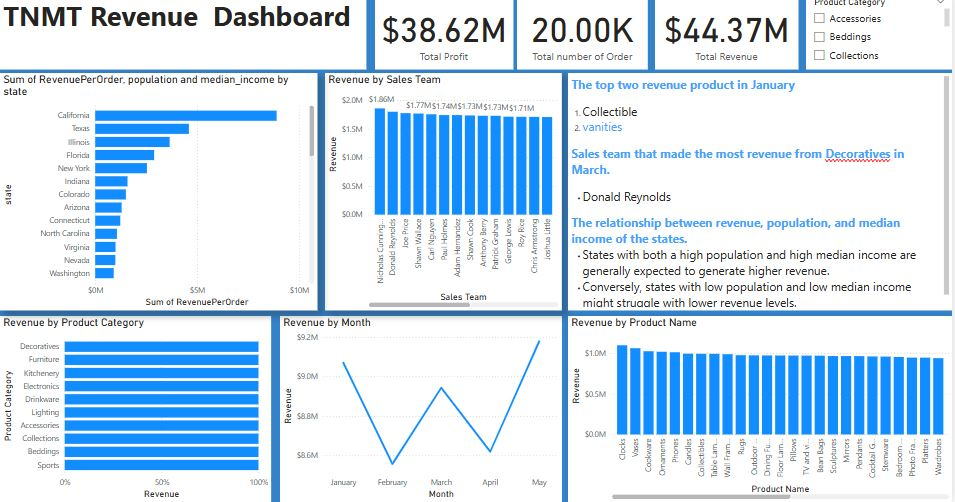

# TNMT Retail Sales Dashboard

## Overview
This Power BI dashboard was developed as part of the Capstone Project for TNMT Retail. The goal was to analyze sales data and provide actionable insights through interactive reports and visualizations.

## Key Features
The dashboard includes the following features:

### 1. Revenue and Profit Calculation
   - Computed total revenue and profit for every order in the dataset.

### 2. Reports & Visualizations
   - **Revenue Trend:** Analyzed revenue patterns over time.
   - **Top Products by Revenue:** Identified the highest-grossing products.
   - **Revenue Contribution by Product Categories:** Visualized percentage contribution of each product category.
   - **Sales Team Performance:** Compared revenue generated by different sales teams.
   - **State-wise Revenue Analysis:** Showcased revenue by state, along with population and median income per state.

### 3. Interactive Dashboard
   - The dashboard is **sliceable by product category**, allowing users to filter data dynamically.

### 4. Key Insights Highlighted
   - **Top 2 revenue-generating products in January.**
   - **Sales team with the highest revenue from the "Decoratives" category in March.**
   - **Correlation between revenue, state population, and median income.**

## Dashboard Preview
Below is a preview of the Power BI dashboard:

## How to Use the Dashboard
1. Open the Power BI file (.pbix) or access the online version (if applicable).
2. Use the slicers to filter data by product category.
3. Navigate through different reports to gain insights into revenue trends, product performance, and state-wise analysis.

## Tools Used
- **Power BI** for data visualization and dashboard creation.
- **Excel/Python/SQL (if applicable)** for data preprocessing and calculations.

## Conclusion
This dashboard provides valuable insights for TNMT Retail, helping stakeholders make data-driven decisions regarding product performance, sales team effectiveness, and regional revenue distribution. By leveraging interactive filtering, users can explore key trends and optimize business strategies.

